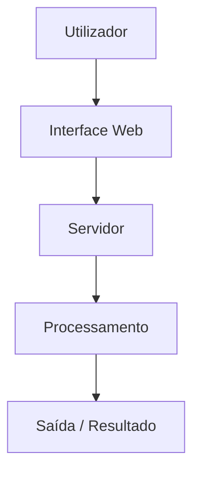

# AndradeIvo/CRUD

<img src="data:image/svg+xml;base64,PHN2ZyB4bWxucz0iaHR0cDovL3d3dy53My5vcmcvMjAwMC9zdmciIHhtbG5zOnhsaW5rPSJodHRwOi8vd3d3LnczLm9yZy8xOTk5L3hsaW5rIiB3aWR0aD0iNjgwIiBoZWlnaHQ9IjUyMCIgdmlld0JveD0iMCAwIDY4MCA1MjAiPgogIDxkZWZzPgogICAgPHN0eWxlPgogICAgICBAa2V5ZnJhbWVzIHR5cGVVcmwgeyB0byB7IHN0cm9rZS1kYXNob2Zmc2V0OiAwOyB9IH0KICAgICAgQGtleWZyYW1lcyBmYWRlSW4geyB0byB7IG9wYWNpdHk6IDE7IH0gfQogICAgICBAa2V5ZnJhbWVzIHB1bHNlQnRuIHsgMCUsMTAwJXtvcGFjaXR5OjF9IDUwJXtvcGFjaXR5Oi43fSB9CiAgICAgIEBrZXlmcmFtZXMgc2xpZGVVcCB7IHRvIHsgdHJhbnNmb3JtOiB0cmFuc2xhdGVZKDApOyBvcGFjaXR5OiAxOyB9IH0KICAgIDwvc3R5bGU+CiAgICA8bGluZWFyR3JhZGllbnQgaWQ9ImJnIiB4MT0iMCIgeTE9IjAiIHgyPSIwIiB5Mj0iMSI+CiAgICAgIDxzdG9wIG9mZnNldD0iMCUiIHN0b3AtY29sb3I9IiMxNjFiMjIiLz4KICAgICAgPHN0b3Agb2Zmc2V0PSIxMDAlIiBzdG9wLWNvbG9yPSIjMGQxMTE3Ii8+CiAgICA8L2xpbmVhckdyYWRpZW50PgogICAgPGxpbmVhckdyYWRpZW50IGlkPSJidG5HcmFkIiB4MT0iMCIgeTE9IjAiIHgyPSIxIiB5Mj0iMCI+CiAgICAgIDxzdG9wIG9mZnNldD0iMCUiIHN0b3AtY29sb3I9IiMyMzg2MzYiLz4KICAgICAgPHN0b3Agb2Zmc2V0PSIxMDAlIiBzdG9wLWNvbG9yPSIjMmVhMDQzIi8+CiAgICA8L2xpbmVhckdyYWRpZW50PgogIDwvZGVmcz4KCiAgPCEtLSBXaW5kb3cgZnJhbWUgLS0+CiAgPHJlY3QgeD0iMCIgeT0iMCIgd2lkdGg9IjY4MCIgaGVpZ2h0PSI1MjAiIHJ4PSIxMiIgZmlsbD0idXJsKCNiZykiIHN0cm9rZT0iIzMwMzYzZCIgc3Ryb2tlLXdpZHRoPSIxLjUiLz4KCiAgPCEtLSBUaXRsZSBiYXIgLS0+CiAgPHJlY3QgeD0iMCIgeT0iMCIgd2lkdGg9IjY4MCIgaGVpZ2h0PSI0MCIgcng9IjEyIiBmaWxsPSIjMjEyNjJkIi8+CiAgPHJlY3QgeD0iMCIgeT0iMjAiIHdpZHRoPSI2ODAiIGhlaWdodD0iMjAiIGZpbGw9IiMyMTI2MmQiLz4KCiAgPCEtLSBUcmFmZmljIGRvdHMgLS0+CiAgPGNpcmNsZSBjeD0iMjAiIGN5PSIyMCIgcj0iNSIgZmlsbD0iI2ZmNWY1NyIvPgogIDxjaXJjbGUgY3g9IjM2IiBjeT0iMjAiIHI9IjUiIGZpbGw9IiNmZmJkMmUiLz4KICA8Y2lyY2xlIGN4PSI1MiIgY3k9IjIwIiByPSI1IiBmaWxsPSIjMjhjODQwIi8+CgogIDwhLS0gVGl0bGUgdGV4dCAtLT4KICA8dGV4dCB4PSI3MCIgeT0iMjUiIGZpbGw9IiM4Yjk0OWUiIGZvbnQtZmFtaWx5PSJTZWdvZSBVSSwgc2Fucy1zZXJpZiIgZm9udC1zaXplPSIxMSI+R2l0IFJlYWQgR2VuZXJhdG9yIOKAlCBBbmRyYWRlSXZvL0NSVUQ8L3RleHQ+CgogIDwhLS0gQ29udGVudCBhcmVhIC0tPgogIDx0ZXh0IHg9IjMwIiB5PSI3NSIgZmlsbD0iIzU4YTZmZiIgZm9udC1mYW1pbHk9IlNlZ29lIFVJLCBzYW5zLXNlcmlmIiBmb250LXNpemU9IjIwIiBmb250LXdlaWdodD0iNzAwIj7wn5OEIEdpdCBSZWFkIEdlbmVyYXRvcjwvdGV4dD4KICA8dGV4dCB4PSIzMCIgeT0iOTgiIGZpbGw9IiM4Yjk0OWUiIGZvbnQtZmFtaWx5PSJTZWdvZSBVSSwgc2Fucy1zZXJpZiIgZm9udC1zaXplPSIxMyI+UkVBRE1FIGludGVsaWdlbnRlIHBhcmEgR2l0SHViLCBnZXJhZG8gcG9yIElBPC90ZXh0PgoKICA8IS0tIFN0ZXAgaW5kaWNhdG9ycyAtLT4KICA8ZyB0cmFuc2Zvcm09InRyYW5zbGF0ZSgzMCwgMTIwKSI+CiAgICA8cmVjdCB4PSIwIiB5PSIwIiB3aWR0aD0iMTkwIiBoZWlnaHQ9IjQ0IiByeD0iOCIgZmlsbD0iIzBkMTExNyIgc3Ryb2tlPSIjMWY2ZmViIiBzdHJva2Utd2lkdGg9IjEuNSI+CiAgICAgIDxhbmltYXRlIGF0dHJpYnV0ZU5hbWU9InN0cm9rZS1vcGFjaXR5IiB2YWx1ZXM9IjE7MC4zOzAuMyIgZHVyPSI2cyIgcmVwZWF0Q291bnQ9ImluZGVmaW5pdGUiLz4KICAgIDwvcmVjdD4KICAgIDxjaXJjbGUgY3g9IjE0IiBjeT0iMjIiIHI9IjEwIiBmaWxsPSIjMWY2ZmViIi8+CiAgICA8dGV4dCB4PSIxNCIgeT0iMjciIGZpbGw9IiNmZmYiIGZvbnQtZmFtaWx5PSJTZWdvZSBVSSwgc2Fucy1zZXJpZiIgZm9udC1zaXplPSIxMCIgZm9udC13ZWlnaHQ9IjcwMCIgdGV4dC1hbmNob3I9Im1pZGRsZSI+MTwvdGV4dD4KICAgIDx0ZXh0IHg9IjMyIiB5PSIyNyIgZmlsbD0iI2M5ZDFkOSIgZm9udC1mYW1pbHk9IlNlZ29lIFVJLCBzYW5zLXNlcmlmIiBmb250LXNpemU9IjExIiBmb250LXdlaWdodD0iNjAwIj5JbnNlcmlyIFVSTDwvdGV4dD4KCiAgICA8cmVjdCB4PSIyMDUiIHk9IjAiIHdpZHRoPSIxOTAiIGhlaWdodD0iNDQiIHJ4PSI4IiBmaWxsPSIjMGQxMTE3IiBzdHJva2U9IiMzMDM2M2QiIHN0cm9rZS13aWR0aD0iMSI+CiAgICAgIDxhbmltYXRlIGF0dHJpYnV0ZU5hbWU9InN0cm9rZS1vcGFjaXR5IiB2YWx1ZXM9IjAuMzsxOzAuMyIgZHVyPSI2cyIgcmVwZWF0Q291bnQ9ImluZGVmaW5pdGUiLz4KICAgIDwvcmVjdD4KICAgIDxjaXJjbGUgY3g9IjIxOSIgY3k9IjIyIiByPSIxMCIgZmlsbD0iIzMwMzYzZCIvPgogICAgPHRleHQgeD0iMjE5IiB5PSIyNyIgZmlsbD0iIzhiOTQ5ZSIgZm9udC1mYW1pbHk9IlNlZ29lIFVJLCBzYW5zLXNlcmlmIiBmb250LXNpemU9IjEwIiBmb250LXdlaWdodD0iNzAwIiB0ZXh0LWFuY2hvcj0ibWlkZGxlIj4yPC90ZXh0PgogICAgPHRleHQgeD0iMjM3IiB5PSIyNyIgZmlsbD0iIzhiOTQ5ZSIgZm9udC1mYW1pbHk9IlNlZ29lIFVJLCBzYW5zLXNlcmlmIiBmb250LXNpemU9IjExIj5HZXJhciBSRUFETUU8L3RleHQ+CgogICAgPHJlY3QgeD0iNDEwIiB5PSIwIiB3aWR0aD0iMTkwIiBoZWlnaHQ9IjQ0IiByeD0iOCIgZmlsbD0iIzBkMTExNyIgc3Ryb2tlPSIjMzAzNjNkIiBzdHJva2Utd2lkdGg9IjEiPgogICAgICA8YW5pbWF0ZSBhdHRyaWJ1dGVOYW1lPSJzdHJva2Utb3BhY2l0eSIgdmFsdWVzPSIwLjM7MC4zOzEiIGR1cj0iNnMiIHJlcGVhdENvdW50PSJpbmRlZmluaXRlIi8+CiAgICA8L3JlY3Q+CiAgICA8Y2lyY2xlIGN4PSI0MjQiIGN5PSIyMiIgcj0iMTAiIGZpbGw9IiMzMDM2M2QiLz4KICAgIDx0ZXh0IHg9IjQyNCIgeT0iMjciIGZpbGw9IiM4Yjk0OWUiIGZvbnQtZmFtaWx5PSJTZWdvZSBVSSwgc2Fucy1zZXJpZiIgZm9udC1zaXplPSIxMCIgZm9udC13ZWlnaHQ9IjcwMCIgdGV4dC1hbmNob3I9Im1pZGRsZSI+MzwvdGV4dD4KICAgIDx0ZXh0IHg9IjQ0MiIgeT0iMjciIGZpbGw9IiM4Yjk0OWUiIGZvbnQtZmFtaWx5PSJTZWdvZSBVSSwgc2Fucy1zZXJpZiIgZm9udC1zaXplPSIxMSI+Q29waWFyPC90ZXh0PgogIDwvZz4KCiAgPCEtLSBVUkwgaW5wdXQgLS0+CiAgPHRleHQgeD0iMzAiIHk9IjE5NSIgZmlsbD0iIzhiOTQ5ZSIgZm9udC1mYW1pbHk9IlNlZ29lIFVJLCBzYW5zLXNlcmlmIiBmb250LXNpemU9IjExIj5VUkwgZG8gcmVwb3NpdMOzcmlvPC90ZXh0PgogIDxyZWN0IHg9IjMwIiB5PSIyMDMiIHdpZHRoPSI2MjAiIGhlaWdodD0iMzgiIHJ4PSI2IiBmaWxsPSIjMGQxMTE3IiBzdHJva2U9IiMzMDM2M2QiIHN0cm9rZS13aWR0aD0iMSIvPgogIDx0ZXh0IHg9IjQ0IiB5PSIyMjciIGZpbGw9IiNjOWQxZDkiIGZvbnQtZmFtaWx5PSJTZWdvZSBVSSwgc2Fucy1zZXJpZiIgZm9udC1zaXplPSIxMyI+aHR0cHM6Ly9naXRodWIuY29tL0FuZHJhZGVJdm8vQ1JVRDwvdGV4dD4KCiAgPCEtLSBDdXJzb3IgYmxpbmsgLS0+CiAgPGxpbmUgeDE9IjM4MCIgeTE9IjIxMyIgeDI9IjM4MCIgeTI9IjIzMSIgc3Ryb2tlPSIjNThhNmZmIiBzdHJva2Utd2lkdGg9IjEuNSI+CiAgICA8YW5pbWF0ZSBhdHRyaWJ1dGVOYW1lPSJvcGFjaXR5IiB2YWx1ZXM9IjE7MDsxIiBkdXI9IjFzIiByZXBlYXRDb3VudD0iaW5kZWZpbml0ZSIvPgogIDwvbGluZT4KCiAgPCEtLSBHZW5lcmF0ZSBidXR0b24gLS0+CiAgPHJlY3QgeD0iMzAiIHk9IjI1NSIgd2lkdGg9IjYyMCIgaGVpZ2h0PSI0MCIgcng9IjYiIGZpbGw9InVybCgjYnRuR3JhZCkiPgogICAgPGFuaW1hdGUgYXR0cmlidXRlTmFtZT0ib3BhY2l0eSIgdmFsdWVzPSIwLjY7MTswLjYiIGR1cj0iMnMiIHJlcGVhdENvdW50PSJpbmRlZmluaXRlIi8+CiAgPC9yZWN0PgogIDx0ZXh0IHg9IjM0MCIgeT0iMjgxIiBmaWxsPSIjZmZmIiBmb250LWZhbWlseT0iU2Vnb2UgVUksIHNhbnMtc2VyaWYiIGZvbnQtc2l6ZT0iMTQiIGZvbnQtd2VpZ2h0PSI2MDAiIHRleHQtYW5jaG9yPSJtaWRkbGUiPuKaoSBHZXJhciBSRUFETUU8L3RleHQ+CgogIDwhLS0gUmVzdWx0IGJveCAoYXBwZWFycyBhZnRlciBkZWxheSkgLS0+CiAgPGcgb3BhY2l0eT0iMCIgdHJhbnNmb3JtPSJ0cmFuc2xhdGUoMCwgLTIwKSI+CiAgICA8YW5pbWF0ZSBhdHRyaWJ1dGVOYW1lPSJvcGFjaXR5IiB2YWx1ZXM9IjA7MDsxIiBkdXI9IjZzIiByZXBlYXRDb3VudD0iaW5kZWZpbml0ZSIvPgogICAgPGFuaW1hdGUgYXR0cmlidXRlTmFtZT0idHJhbnNmb3JtIiB0eXBlPSJ0cmFuc2xhdGUiIHZhbHVlcz0iMCAtMjA7MCAtMjA7MCAwIiBkdXI9IjZzIiByZXBlYXRDb3VudD0iaW5kZWZpbml0ZSIvPgogICAgPHJlY3QgeD0iMzAiIHk9IjMxMCIgd2lkdGg9IjYyMCIgaGVpZ2h0PSIxOTAiIHJ4PSI4IiBmaWxsPSIjMGQxMTE3IiBzdHJva2U9IiMzMDM2M2QiIHN0cm9rZS13aWR0aD0iMSIvPgogICAgPHJlY3QgeD0iMzAiIHk9IjMxMCIgd2lkdGg9IjYyMCIgaGVpZ2h0PSIzNiIgcng9IjgiIGZpbGw9IiMxNjFiMjIiLz4KICAgIDxyZWN0IHg9IjMwIiB5PSIzMjgiIHdpZHRoPSI2MjAiIGhlaWdodD0iMTgiIGZpbGw9IiMxNjFiMjIiLz4KICAgIDx0ZXh0IHg9IjQ0IiB5PSIzMzMiIGZpbGw9IiM1OGE2ZmYiIGZvbnQtZmFtaWx5PSJTZWdvZSBVSSwgc2Fucy1zZXJpZiIgZm9udC1zaXplPSIxMiIgZm9udC13ZWlnaHQ9IjYwMCI+4pyFIFJFQURNRSBnZXJhZG8gY29tIHN1Y2Vzc288L3RleHQ+CgogICAgPHRleHQgeD0iNDQiIHk9IjM3MCIgZmlsbD0iIzhiOTQ5ZSIgZm9udC1mYW1pbHk9IkNhc2NhZGlhIENvZGUsIG1vbm9zcGFjZSIgZm9udC1zaXplPSIxMCI+IyBBbmRyYWRlSXZvL0NSVUQ8L3RleHQ+CiAgICA8dGV4dCB4PSI0NCIgeT0iMzg4IiBmaWxsPSIjOGI5NDllIiBmb250LWZhbWlseT0iQ2FzY2FkaWEgQ29kZSwgbW9ub3NwYWNlIiBmb250LXNpemU9IjEwIj4+IEEgQ1JVRCBzeXN0ZW0gZGV2ZWxvcGVkIGluIEMjIHVzaW5nIFZpc3VhbCBTdHVkaW8gb24gV2luZG93czwvdGV4dD4KICAgIDx0ZXh0IHg9IjQ0IiB5PSI0MDYiIGZpbGw9IiM4Yjk0OWUiIGZvbnQtZmFtaWx5PSJDYXNjYWRpYSBDb2RlLCBtb25vc3BhY2UiIGZvbnQtc2l6ZT0iMTAiPjwvdGV4dD4KICAgIDx0ZXh0IHg9IjQ0IiB5PSI0MjQiIGZpbGw9IiM4Yjk0OWUiIGZvbnQtZmFtaWx5PSJDYXNjYWRpYSBDb2RlLCBtb25vc3BhY2UiIGZvbnQtc2l6ZT0iMTAiPiMjIFRlY25vbG9naWFzPC90ZXh0PgogICAgPHRleHQgeD0iNDQiIHk9IjQ0MiIgZmlsbD0iIzhiOTQ5ZSIgZm9udC1mYW1pbHk9IkNhc2NhZGlhIENvZGUsIG1vbm9zcGFjZSIgZm9udC1zaXplPSIxMCI+IyMgSW5zdGFsYcOnw6NvPC90ZXh0PgogICAgPHRleHQgeD0iNDQiIHk9IjQ2MCIgZmlsbD0iIzhiOTQ5ZSIgZm9udC1mYW1pbHk9IkNhc2NhZGlhIENvZGUsIG1vbm9zcGFjZSIgZm9udC1zaXplPSIxMCI+IyMgRmx1eG8gZG8gUHJvamV0bzwvdGV4dD4KICAgIDx0ZXh0IHg9IjQ0IiB5PSI0NzgiIGZpbGw9IiMzMDM2M2QiIGZvbnQtZmFtaWx5PSJDYXNjYWRpYSBDb2RlLCBtb25vc3BhY2UiIGZvbnQtc2l6ZT0iMTAiPvCfmoAgR2VyYWRvIHBvciBHaXQgUmVhZCBHZW5lcmF0b3I8L3RleHQ+CiAgPC9nPgoKICA8IS0tIENvcm5lciBiYWRnZSAtLT4KICA8cmVjdCB4PSI1NDAiIHk9IjQ2NiIgd2lkdGg9IjEyMCIgaGVpZ2h0PSIzNCIgcng9IjYiIGZpbGw9IiMxNjFiMjIiIHN0cm9rZT0iIzMwMzYzZCIgc3Ryb2tlLXdpZHRoPSIxIi8+CiAgPHRleHQgeD0iNjAwIiB5PSI0ODgiIGZpbGw9IiM1OGE2ZmYiIGZvbnQtZmFtaWx5PSJTZWdvZSBVSSwgc2Fucy1zZXJpZiIgZm9udC1zaXplPSI5IiB0ZXh0LWFuY2hvcj0ibWlkZGxlIiBmb250LXdlaWdodD0iNjAwIj7wn46vIEFJLVBvd2VyZWQ8L3RleHQ+Cjwvc3ZnPg==" alt="Git Read Generator Preview" width="100%">

> A CRUD system developed in C# using Visual Studio on Windows Forms, integrated with a MySQL database. It enables users to create, read, update, and delete records through an intuitive interface, ensuring efficient data management and seamless interaction between UI and database.

## 🔄 Fluxo do Projeto

Diagrama de funcionamento do **CRUD**:

## 📝 Descrição

A CRUD system developed in C# using Visual Studio on Windows Forms, integrated with a MySQL database. It enables users to create, read, update, and delete records through an intuitive interface, ensuring efficient data management and seamless interaction between UI and database.

Este projeto foi desenvolvido com o objetivo de fornecer uma solução eficiente e moderna para os seus utilizadores.

README gerado por <a href="https://github.com/AndradeIvo/GitHUb-Stats-Generator">Git Read Generator</a>

